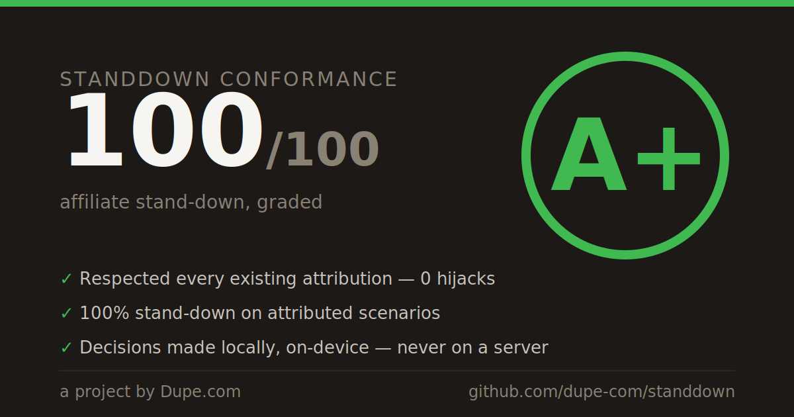

# 🛡️ Graded with standdown

Extensions that ran the [standdown](./README.md) affiliate conformance grader and
proved they stand down instead of hijacking existing attribution.

**Every grade here is reproduced by CI.** A submission declares only its policy
inputs; [`showcase-verify.yml`](./.github/workflows/showcase-verify.yml) re-runs
`conformanceGrade` on those inputs, regenerates the card, and rejects any
mismatch — so the number can't be faked and the card can't be hand-edited. See
[`showcase/README.md`](./showcase/README.md) to add yours (one prompt, one PR).

> The grade proves a policy configuration decides correctly. It does not by itself
> prove the *deployed* extension uses that configuration — live-extension
> verification (Chrome Web Store source) is a planned second tier.

---

### [standdown reference (allPolicies baseline)](https://github.com/dupe-com/standdown) — A+ (100/100)

✅ **Reproduced by standdown CI** · inputs `sha256:85225d2cd7cc` · allPolicies+experimental · submitted by dupe-com · 2026-07-13

