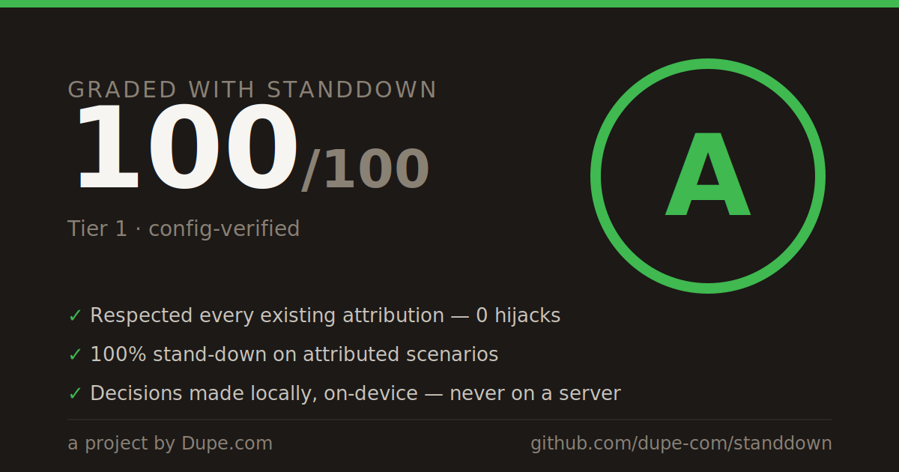

# 🛡️ Graded with standdown

Extensions that ran the [standdown](./README.md) affiliate conformance grader and
proved they stand down instead of hijacking existing attribution.

**Every badge here is reproduced by CI**, and the letter reflects the
**verification tier**:

| Badge | Tier | What CI proved |
| --- | --- | --- |
| **A** | Tier 1 — config-verified | Re-ran `conformanceGrade` on the declared policy inputs and reproduced the grade. |
| **A+** | Tier 2 — live-verified | Additionally fetched the **published** crx from the Chrome Web Store and confirmed it bundles this exact policy set (matching inputs SHA). |

A submission declares only its policy inputs;
[`showcase-verify.yml`](./.github/workflows/showcase-verify.yml) recomputes the
grade + SHA and regenerates the card, rejecting any mismatch — the number can't be
faked and the card can't be hand-edited. The top mark (**A+**) is earned by
proving the *deployed* extension actually uses the graded config, so Tier 1 caps
at **A**. See [`showcase/README.md`](./showcase/README.md) to add yours (one
prompt, one PR).

---

### [Dupe.com: Find similar products for less](https://dupe.com) — A

✅ **Reproduced by standdown CI** · **Tier 1 · config-verified** · conformance A+ (100/100) · inputs `sha256:1ccc48f554b3` · custom · submitted by i8ramin · 2026-07-13 · [Chrome Web Store](https://chrome.google.com/webstore/detail/pkhpcfoaocmmpmphhenoblggeinedlah)

> ⬆️ **Upgrade to A+:** verify this on the live published extension — see [showcase/README.md](./showcase/README.md#reach-a-tier-2).

